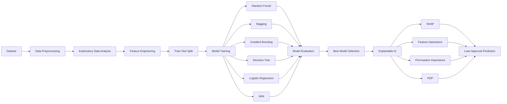

LOAN APPROVAL ANALYTICS

## Overview 
Predicts loan approval using Decision Tree, Random Forest and Gradient Boosting with SHAP explainability and data preprocessing.

## Project Architecture

## Results:

## Tech Stack
Programming Language: Python
Libraries: Pandas, NumPy, Scikit-learn, SHAP, Matplotlib, Seaborn
Machine Learning Models: Random Forest, Bagging Classifier, Gradient Boosting, Decision Tree, Logistic Regression, k-Nearest Neighbors (kNN)
Explainable AI (XAI): SHAP, Permutation Importance, Feature Importance, Partial Dependence Plots (PDP)
Development Environment: Jupyter Notebook / Google Colab

