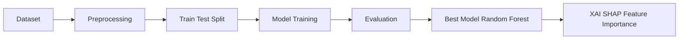

LOAN APPROVAL ANALYTICS

Predicts loan approval using Decision Tree, Random Forest and Gradient Boosting with SHAP explainability and data preprocessing.

## Model Results & Insights

Evaluated multiple ML models, where ensemble methods outperformed others.

Best Model: Random Forest
  Accuracy: 97.89%, F1: 98.33%, ROC-AUC: 0.9982→ best balance & performance

Second: Bagging (RF base)
  Accuracy: 97.50%, highest precision → fewer false positives

Gradient Boosting & Decision Tree
  Similar performance but slightly lower generalization

Logistic Regression & kNN
  Lower scores → dataset has non-linear patterns

 Key insight observed:
Tree-based ensembles work best due to complex feature relationships.


## Explainable AI (XAI)

Applied on top 2 models using Feature Importance, Permutation Importance, SHAP, and PDP:

- Consistent top features across methods → robust model behavior
-  SHAP explains individual predictions clearly
-   PDP shows non-linear feature impact

## Result: Model is both accurate and interpretable

## Conclusion

Random Forest selected as final model due to best overall performance.
Achieved 98% accuracy with explainability, ensuring reliability for real-world use.

## Project Architecture

```


